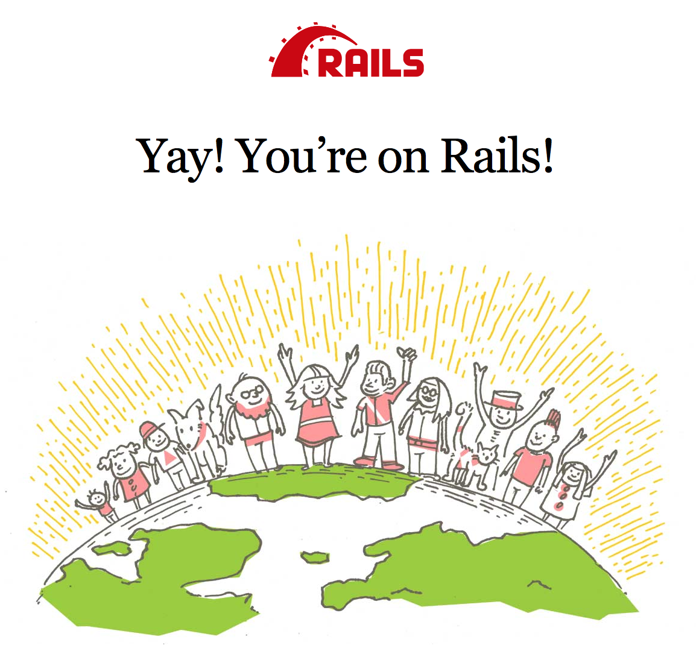
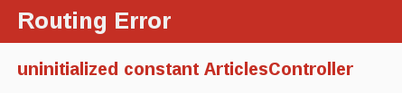
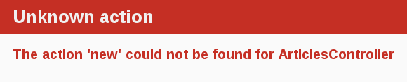

**DO NOT READ THIS FILE ON GITHUB, GUIDES ARE PUBLISHED ON http://guides.rubyonrails.org.**

Erste Schritte mit Rails
==========================

Dieser Leitfaden umfasst das Einrichten und Ausführen von Ruby on Rails.

Nach dem Lesen des Leitfadens wird man folgendes wissen:

* Wie man Rails installiert, eine neue Railsanwendung erstellt und die
  Anwendung mit einer Datenbank verbindet.
* Der allgemeine Aufbau einer Railsanwendung.
* Die grundlegenden Prinzipien von MVC (Model, View, Controller) und RESTful Design.
* Wie man schnell die Startkomponenten einer Railsanwendung erstellt.

--------------------------------------------------------------------------------

Voraussetzungen des Leitfadens
-----------------

Dieser Leitfaden wurde für Anfänger entwickelt, die mit einer Railsanwendung
von Grund auf anfangen möchten. Es ist nicht erforderlich, dass man schon
Erfahrungen mit Rails gesammelt hat. Jedoch müssen einige Systemvorausetzungen
erfüllt sein:

* [Ruby](https://www.ruby-lang.org/en/downloads) Version 2.2.2 oder aktueller.
* Die richtige Version des [Development Kit](http://rubyinstaller.org/downloads/),
  wenn man Windows benutzt.
* Das [RubyGems](https://rubygems.org) Packaging System, das standardmäßig mit
  Ruby installiert wird. Weiterführende Informationen über RubyGems gibt es hier:
  [RubyGems Guides](http://guides.rubygems.org).
* Einerfunktionierende Installation einer [SQLite3 Datenbank](https://www.sqlite.org).

Rails ist ein Framework für Webanwendungen, das auf der Programmiersprache Ruby
basiert. Wenn man noch keine Erfahrung mit Ruby hat, gibt es eine sehr hohe Lernkurve
beim Erlernen von Rails. Es einige Möglichkeiten, um Ruby online zu lernen:

* [Die offizielle Webseite von Ruby](https://www.ruby-lang.org/en/documentation/)
* [Eine Liste mit kostenfreien Programmierbüchern](https://github.com/vhf/free-programming-books/blob/master/free-programming-books.md#ruby)

Man muss sich aber bewusst sein, dass manche Quellen, auch wenn sie sehr gut sind,
alte Versionen von Ruby (1.6 oder überlicherweise 1.8) abdecken und keine Syntax
der aktuellen Railsversion zeigen.

Was ist Rails?
--------------

Rails ist ein Framework für Webanwendungen, dass in Ruby geschrieben wurde.
Es ist so konzipiert, dass Webanwendungen leicht erstellt werden können, indem
Annahmen getroffen wurden, die jeder Entwickler benötigt, um anzufangen.
Rails ermöglicht es mit weniger Code mehr zu erreichen als andere Sprachen oder
Frameworks. Erfahrene Railsentwickler berichten auch, dass es mehr Spaß macht
Webanwendungen zu erstellen.

Rails ist eine dogmatische Software. Es setzt voraus, das es den "besten" Weg
gibt, um Dinge zu tun und es wurde so konzipiert, dass es diesen Weg fördert -
und in manchen Fällen Alternativen verhindert. Wenn man den "Railsweg" geht,
wird man wahrscheinlich eine gewaltige Steigerung von Produktivität bemerken.
Versuch man alte Gewohnheiten und Strukturen von anderen Sprachen
in die Railsentwicklung zu stecken, wird man wahrscheinlich eine weniger
freudige Erfahrung machen.

Die Philosophie von Rails beinhaltet 2 Hauptprinzipien:

* **Don't Repeat Yourself (Wiederhole dich nicht):** DRY ist ein Prinzip der
  Softwareentwicklung, das besagt, dass "Jede Erkenntnis eine einzelne,
  eindeutige und verbindliche Darstellung innerhalb eines Systems haben muss."
  Wenn eine Information nicht immer und immer wieder geschrieben werden muss,
  lässt sich der Code besser verwalten, erweitern und ist weniger fehlerhaft.
* **Convention Over Configuration (Konvention über Konfiguration):** Rails hat
  eigene Vorstellungen davon, wie der beste Weg aussieht, um Dinge in einer
  Webanwendung zu tun und spezifiziert das in einer Reihe von Konventionen,
  anstatt endlose Konfigurationsdateien zu benötigen, die genauestens bestimmt
  werden müssen.

Erstellen eines neuen Railsprojekts
----------------------------
Der beste Weg diesen Leitfaden zu lesen ist ihn Schritt für Schritt zu
befolgen. Alle Schritte sind grundlegend, um die Beispielanwendung laufen zu
lassen, es wird kein zusätzlicher Code benötigt.

Bei dem Befolgen des Leitfadens wird ein Railsprojekt namens `blog` erstellt,
ein (sehr) einfacher Weblog. Vor dem Erstellen der Anwendung muss sichergestellt
werden, dass Rails selbst installiert ist.

TIPP: Die folgenden Beispiele nutzen `$`, um das Terminal in einem unixoiden
Betriebssystem darzustellen (kann auch abgeändert worden sein).
Wenn man Windows nutzt, wird das Terminal ungefähr so aussehen:
`c:\source_code>`.

### Rails installieren

Es muss ein Terminal geöffnet werden: Unter Mac OS X öffnet man Terminal.app,
unter Windows muss man "Ausführen" aus dem Startmenü aufrufen und 'cmd.exe'
eingeben und bestätigen. Alle Befehle, die mit einem Dollarzeichen `$`
anfangen, sollen im Terminal ausgeführt werden. Es muss sichergestellt werden,
dass man die aktuelle Rubyversion installiert hat:

```bash
$ ruby -v
ruby 2.3.1p112
```

TIPP: Es gibt einige Tools mit denen man schnell Ruby und Ruby on Rails
installieren kann. Unter Windows kann man den [Rails Installer](http://railsinstaller.org)
benutzen, während man unter Mac OS X [Tokaido](https://github.com/tokaido/tokaidoapp)
nutzen kann. Für weitere Installationsmöglichkeiten für die meisten Betriebssysteme
kann unter [ruby-lang.org](https://www.ruby-lang.org/en/documentation/installation/)
nachschauen.

Viele bekannte unixoide Betriebssysteme kommen standardmäßig mit einer
passenden SQLite3-Version. Wenn man Rails mit dem Railsinstaller unter
Windows installiert hat, hat man automatisch auch SQLite installiert.
Wenn nicht, gibt es auf der [SQLite3 Website](https://www.sqlite.org)
Installationsanweisungen.
Es muss überprüft werden, ob es korrekt installiert wurde.

```bash
$ sqlite3 --version
```

Dieser Befehl sollte die installierte Version ausgeben.

Rails wird über den Befehl `gem install` installiert:

```bash
$ gem install rails
```

Um sicherzustellen, dass alles korrekt installiert wurde, sollte man
folgendes ausführen können:

```bash
$ rails --version
```

Wenn etwas wie "Rails 5.0.0" ausgegeben wird, kann man weitermachen.

### Erstellen der Bloganwendung

Rails hat einige Skripte, die "generators" genannt werden, die erstellt wurden,
um die Entwicklung leichter zu machen, in dem sie alles bereitstellen, dass
nötig ist, um eine bestimmte Aufgabe anzufangen. Eines dieser Skripte ist der
Generator zum Erstellen einer neuen Anwendung, der die Grundlagen einer
frischen Railsanwendung schaft, so dass man sie nicht selbst anlegen muss.

Um den Generator zu nutzen, muss man ein Terminal öffnen, zu einem Verzeichnis
gehen, in dem man Dateien erstellen darf und folgenden Befehl eingeben:

```bash
$ rails new blog
```

Dies wird eine Railsanwendung namens Blog in einem `blog` Verzeichnis
erstellen und die Gem-Abhängigkeiten, die in der `Gemfile` festgelegt sind,
über `bundle install` installieren.

HINWEIS: Es gibt ein paar Beschränkungen des Dateisystems, wenn man ein
Windows-Subsystem für Linux nutzt. Das bedeutet, dass man die Gems `spring`
und `listen` deaktivieren sollte. Das geht über den Befehl
`rails new blog --skip-spring --skip-listen`.

TIPP: Mit dem Befehl `rails new -h` sieht man alle Kommandozeilenbefehle, die
der Railsbuilder akzeptiert.

Nachdem dem Erstellen der Bloganwendung muss in deren Ordner gewechselt werden:

```bash
$ cd blog
```

Der `blog`-Ordner beinhaltet einige automatisch erstellte Dateien und Ordner,
die die Struktur einer Railsanwendung wiedergeben. Die Hauptarbeit dieses
Leitfadens findet im Ordner `app` statt. Hier folg ein kurzer Überblick über
die Funktionen der Dateien und Ordner, die Rails standardmäßig erstellt:

| Datei/Ordner | Aufgabe |
| ------------ | ------- |
|app/|Beinhaltet die Controller, Models, Views, Helpers, Mailers, Channels, Jobs und Assets für die Anwendung. Der restliche Teil dieses Leitfadens fokussiert sich auf diesen Ordner.|
|bin/|Enthält das Railsskript, dass die Anwendung startet und einige andere Skripte zur Einrichtung, Aktualisierung, Verteilung oder zum Laufen der Anwendung.|
|config/|Hier werden die Routen, Datenbanken und noch mehr konfiguriert. Detailierter wird es in [Konfigurieren einer Railsanwendung](configuring.html) beschrieben.|
|config.ru|Enthält die Rackkonfiguration für rackbasierte Server, um die Anwendung zu starten.|
|db/|Enthält das aktuelle Datenbankschmema, sowie die Datenbankmigrationen.|
|Gemfile<br>Gemfile.lock|Diese Dateien erlauben es, die Gemabhängigkeiten der Anwendung genauer festzulegen. Diese Dateien werden von dem Bundlergem genutzt. Weitere Informationen zu Bundler gibt es hier: [Bundler Website](http://bundler.io).|
|lib/|Erweiterte Module für die Anwendung.|
|log/|Die Logdateien der Anwendung.|
|public/|Der einzige Ordner, der von außen so gesehen wird, wie er ist. Enthält statische Dateien und kompilierte Assets.|
|Rakefile|Diese Datei bestimmt und lädt Aufgaben, die über die Kommandozeile ausgeführt werden können. Die Aufgabendefinitionen werden durch die Komponenten von Rails bestimmt. Anstatt die Rakefile zu ändern, sollte man eigene Aufgaben hinzufügen, in dem man Dateien in den lib- oder tasks-Ordner der Anwendung hinzufügt.|
|README.md|Das ist eine kurze Einführungsanleitung für die Anwendung. Man sollte sie bearbeiten, um anderen mitzuteilen, was die Anwendung macht, wie sie eingerichtet wird usw.|
|test/|Tests für Units, Fixtures, und andere Testmöglichkeiten. Diese werden in [Testen einer Railsanwendung](testing.html) behandelt.|
|tmp/|Temporäre Dateien (wie cache- und pid-Dateien).|
|vendor/|Enthält Code von Dritten. In einer typischen Railsinstallation sind hier Vendorgems.|
|.gitignore|Diese Datei legt fest, welche Dateien git ignorieren soll. Weitere Informationen finden sich unter [Github - Ignoring files](https://help.github.com/articles/ignoring-files).

Hallo, Rails!
-------------

Für den Anfang soll ein kurzer Text dargestellt werden. Um das zu erreichen,
muss der Server der Anwendung laufen.

### Den Webserver starten

Durch die oben beschriebenen Schritte hat man schon eine funktionierende
Railsanwendung. Um sie zu sehen, muss der Webserver auf dem Entwicklungsrechner
gestartet werden. Das kann über folgenden Befehl im `blog`-Ordner gemacht
werden:

```bash
$ bin/rails server
```

TIPP: Wenn man Windows benutzt, müssen die Skripte im `bin`-Ordner direkt
an den Rubyinterpreter übergeben werden, z.B. `ruby bin\rails server`.

TIPP: Um die Assetkompression von CoffeeScript und JavaScript kompilieren zu
können, muss eine JavaScript-Laufzeitumgebung verfügbar sein. Wenn dem nicht
so ist, erhält man eine `execjs`-Fehlermeldung während des Kompilierens.
Üblicherweise ist bei Mac OS X und Windows eine JavaScript-Laufzeitumgebung
installiert. Rails fügt bei neuerstellten Anwendungen den Gem `therubyracer`
in einer kommentierten Zeile in der erstellten `Gemfile` hinzu. Bei Bedarf
kann der Kommentar entfernt werden.
`therubyrhino` ist die empfohlene Laufzeitumgebung für JRuby-Benutzer und ist
standardmäßig in der `Gemfile` enthalten, wenn Anwendung unter JRuby erstellt
werden. Alle unterstützen Laufzeitumgebungen sind hier aufgeführt:
[ExecJS](https://github.com/rails/execjs#readme).

Der oben genannte Befehl startet Puma, einen Webserver, der automatisch mit Rails
ausgeliefert wird. Um die laufende Anwedung zu sehen, muss man ein
Browserfenster öffnen und die Adresse <http://localhost:3000> aufrufen.
Man sollte nun die voreingestellte Informationsseite sehen:



TIPP: Um den Webserver zu stoppen, muss man in dem Terminalfenster, in dem der
Server läuft, STRG+C drücken. Nun sollte man den normalen Cursor im Terminal
sehen. Für die meisten unixoiden Betriebssysteme, was auch Mac OS X beinhaltet,
ist das ein Dollarzeichen `$`. Im Entwicklungsmodus von Rails ist ein Neustart
allgemein nicht nötig. Veränderungen von Dateien werden vom Server automatisch
erkannt.

Die Seite "Welcome aboard" ist ein [_Rauchtest_](https://de.wikipedia.org/wiki/Smoke_testing)
für eine neue Railsanwendung: Er stellt sicher, dass die Software richtig
eingerichtet wurde, um eine Webseite anzuzeigen.

### Rails, sag "Hello"

Um Rails dazu zu bringen "Hello" anzuzeigen, muss mindestens ein
_controller_ und eine _view_ erstellt werden.

Die Aufgabe eines Controllers ist es spezifische Anfragen der Anwendung zu
empfangen. Das _Routing_ entscheidet, welcher Controller welche Anfrage empfängt.
Es gibt oft mehr als eine Route zu jedem Controller. Verschiedene Routen
werden von verschiedenen _actions_ bedient. Die Aufgabe jeder Action ist es
Informationen zu sammeln und diese der View zur Verfügung zu stellen.

Die Aufgabe der View ist es, diese Informationen in einem für Menschen
lesbaren Format darzustellen. Ein wichtiger Unterschied ist, dass der
_controller_ Informationen sammelt, nicht die View. Standardmäßig werden
Vorlagen (Templates) der View in eRuby (Embedded Ruby) geschrieben, die erst
verarbeitet werden, bevor sie zum Benutzer geschickt werden.

Um einen neuen Controller zu erstellen, muss der Controller-Generator
ausgeführt werden. In diesem Fall mit Namen "Welcome" und der Action "index":

```bash
$ bin/rails generate controller Welcome index
```

Rails erstellt damit verschiedene Dateien und eine Route:

```bash
create  app/controllers/welcome_controller.rb
 route  get 'welcome/index'
invoke  erb
create    app/views/welcome
create    app/views/welcome/index.html.erb
invoke  test_unit
create    test/controllers/welcome_controller_test.rb
invoke  helper
create    app/helpers/welcome_helper.rb
invoke    test_unit
invoke  assets
invoke    coffee
create      app/assets/javascripts/welcome.coffee
invoke    scss
create      app/assets/stylesheets/welcome.scss
```

Am Wichtigsten von diesen Dateien sind natürlich der Controller
(der sich unter `app/controllers/welcome_controller.rb` befindet) und die
View (die sich unter `app/views/welcome/index.html.erb` befindet),

Nun wird die View in einem Texteditor geöffnet, alles darin gelöscht und
durch folgende Zeile ersetzt:

```html
<h1>Hello, Rails!</h1>
```

### Einrichten der Hauptseite

Jetzt, da der Controller und die View erstellt wurden, muss Rails noch
mitgeteilt werden, in welchem Fall "Hello, Rails!" erscheinen soll. Hier soll
es erscheinen, wenn man die Hauptadresse <http://localhost:3000> aufruft. Im
Moment wird das aber noch von "Welcome aboard" besetzt.

Als nächstes muss Rails wissen, wo sich die aktuelle Hauptseite befindet.

Dazu muss man die Datei `config/routes.rb` in einem Editor öffnen.

```ruby
Rails.application.routes.draw do
  get 'welcome/index'

  # For details on the DSL available within this file, see http://guides.rubyonrails.org/routing.html
end
```

Dies ist die _routing file_ der Anwendung, die Einträge in einer bestimmten
[DSL (domain-specific language)](http://en.wikipedia.org/wiki/Domain-specific_language)
enthält. Durch diese weiß Rails, welche eintreffenden Anfragen mit welchem
Controller und welcher Action verbunden werden sollen.
Diese Datei muss um folgendes erweitert werden: `root 'welcome#index'`.
Dadurch sollte es jetzt so aussehen:

```ruby
Rails.application.routes.draw do
  get 'welcome/index'

  root 'welcome#index'
end
```

`root 'welcome#index'` teilt Rails mit, dass Anfragen auf die Hauptadresse der
Anwendung durch die Index-Action des Welcome-Controllers abgebildet werden sollen.
`get 'welcome/index'` teilt Rails mit, dass Anfragen auf
<http://localhost:3000/welcome/index> auch durch die Index-Action des
Welcome-Controllers bearbeitet werden sollen. Das wurde festgelegt, als der
Generator des Controllers ausgeführt wurde
(`bin/rails generate controller Welcome index`).

Falls der Webserver für das Erstellen des Controllers gestoppt wurde, muss man
ihn nun erneut starten (`bin/rails server`) und <http://localhost:3000> in
einem Browser aufrufen. Jetzt sollte man "Hello, Rails!" sehen, was zeigt,
dass die neue Route des `WelcomeControllers` zur `index`-Action führt
und die View korrekt dargestellt wird.

TIPP: Weitere Informationen zum Routing gibt es hier [Rails Routing from the Outside In](routing.html).

Konfigurieren und Ausführen
----------------------

Jetzt, da man gesehen hat, wie man einen Controller, eine Action und eine View
erstellt, kann man etwas anspruchsvolleres erstellen.

In der Bloganwendung wird nun eine neue _resource_ erstellt. Eine Ressouce steht
für eine Sammlung gleicher Objekte, wie Artikel, Leute oder Tiere verwendet wird.

Man kann Einzelteile einer Ressouce erstellen (create), lesen (read),
aktualisieren (update) und löschen (destroy). Diese Operationen werden als
_CRUD_ -Operationen bezeichnet.

Rails stellt eine `resources`-Funktion zur Verfügung, die genutzt werden kann,
um eine standardmäßige REST-Ressource festzulegen. Man muss die
_article resource_ folgendermaßen zu `config/routes.rb` hinzufügen:


```ruby
Rails.application.routes.draw do
  get 'welcome/index'

  resources :articles

  root 'welcome#index'
end
```

Wenn man `bin/rails routes` ausführt, sieht man, dass es nun definierte Routen
für alle standardmäßigen "RESTful Actions" gibt. Die Bedeutung der
verschiedenen Spalten wird später erklärt. Fürs Erste reicht, dass man sieht,
dass Rails die Einzahl `article` verwendet und von dem Unterschied zwischen
Einzahl und Mehrzahl Gebrauch macht.

```bash
$ bin/rails routes
      Prefix Verb   URI Pattern                  Controller#Action
    articles GET    /articles(.:format)          articles#index
             POST   /articles(.:format)          articles#create
 new_article GET    /articles/new(.:format)      articles#new
edit_article GET    /articles/:id/edit(.:format) articles#edit
     article GET    /articles/:id(.:format)      articles#show
             PATCH  /articles/:id(.:format)      articles#update
             PUT    /articles/:id(.:format)      articles#update
             DELETE /articles/:id(.:format)      articles#destroy
        root GET    /                            welcome#index
```

Im nächsten Abschnitt wird in der Anwendung die Möglichkeit hinzugefügt neue
Artikel anzulegen und diese anzuzeigen. Das ist das "C" und das "R" von
CRUD: create (ersellen) und read (lesen). Das Formular für das Erstellen eines
neuen Artikels wird so aussehen:


Fürs Erste sieht das etwas einfach aus, aber das ist ok. Im weiteren Verlauf
wird das Aussehen verbessert.

### Die Grundlage bilden

Als erstes benötigt man einen Bereich innerhalb der Anwendung, um einen neuen
Artikel zu erstellen. Ein passender Bereich dafür wäre unter `/articles/new`.
Da die Route schon erstellt wurde, können nun Anfragen zu `/articles/new`
gemacht werden. Wenn die Adresse <http://localhost:3000/articles/new> aufruft,
erhält man einen Routingfehler:



Dieser Fehler tritt auf, da die Route einen Controller haben muss, um die
Anfrage zu bedienen. The Lösung für dieses spezielle Problem ist einfach:
man erstellt ein Controller `ArticlesController`. Das kann über folgenden
Befehl getan werden:

```bash
$ bin/rails generate controller Articles
```

Wenn man nun die gerade erstellte Datei `app/controllers/articles_controller.rb`
aufruft, sieht man einen recht leeren Controller:

```ruby
class ArticlesController < ApplicationController
end
```

Ein Controller ist, einfach gesagt, eine Klasse, die so definiert ist, dass
sie vom `ApplicationController` vererbt ist.
Innerhalb dieser Klasse werden Methoden definiert, die dann Actions des
Controllers werden. Diese Actions führen CRUD-Operationen auf Artikel aus.

HINWEIS: Es gibt drei verschiedene Arten von Methoden in Ruby: `public`,
`private` and `protected`, aber nur `public`-Methoden können Actions eines
Controllers sein.
Weitere Details finden sich unter [Programming Ruby](http://www.ruby-doc.org/docs/ProgrammingRuby/).

Wenn man nun die Adresse <http://localhost:3000/articles/new> aktualisiert,
bekommt man einen neuen Fehler angezeigt:



Dieser Fehler weist darauf hin, dass Rails die Action `new` nicht im
`ArticlesController` finden kann. Der Grund dafür ist, dass in Rails erstellte
Controller standardmäßig leer sind, es sei denn man teilt ihnen beim Erstellen
Actions mit.

Um eine Action in einem Controller manuell zu erstellen, muss man sie nur zum
Controller hinzufügen. In diesem Fall öffnet man dazu
`app/controllers/articles_controller.rb` und definiert innerhalb der Klasse
`ArticlesController` die Methode `new`, so dass der Controller so aussieht:

```ruby
class ArticlesController < ApplicationController
  def new
  end
end
```

Aktualisiert man die Adresse <http://localhost:3000/articles/new> mit der
nun erstellten Methode `new` im `ArticlesController` sieht man einen
anderen Fehler:


Man bekommt diesen Fehler, weil Rails bei einfachen Methoden, wie der gerade
erstellten, erwartet, dass damit eine View verbunden ist, die die Informationen
der Methode darstellt. Da keine View erstellt wurde, bringt Rails einen Fehler.

Im oberen Bild wurde ein Teil der Fehlermeldung abgeschnitten. So sieht sie
komplett aus:

>ArticlesController#new is missing a template for this request format and variant. request.formats: ["text/html"] request.variant: [] NOTE! For XHR/Ajax or API requests, this action would normally respond with 204 No Content: an empty white screen. Since you're loading it in a web browser, we assume that you expected to actually render a template, not… nothing, so we're showing an error to be extra-clear. If you expect 204 No Content, carry on. That's what you'll get from an XHR or API request. Give it a shot.

Das ist schon sehr viel Text. Im Folgenden gibt es einen kurzen Überblick, was
die Fehlermeldung im Einzelnen bedeutet.

Der erste Teil beschreibt, welches Template fehlt. In diesem Fall ist es das
Template `articles/new`. Rails sucht als erstes dieses Template. Wenn es nicht
gefunden wird, wird versucht das Template `application/new` zu laden. Dieses
wird deswegen gesucht, weil der `ArticlesController` vom
`ApplicationController` vererbt wird.

Der nächste Teil der Fehlermeldung enthält `request.formats`, was beschreibt in
welchem Format das Template ausgeliefert werden soll. Das Format wurde auf
`text/html` festgelegt, da die Anfrage über einen Browser gestellt wurde und
Rails dadurch ein HTML-Template sucht. `request.variant` spezifiziert, welche
Art von Gerät bei der Antwort bedient wird und hilft Rails festzustellen,
welches Template für die Antwort genutzt werden soll. Es ist leer, weil keine
Information zur Verfügung gestellt wird.

Das einfachste Template, das in diesem Fall funktionieren würde, würde sich
unter `app/views/articles/new.html.erb` befinden. Die Erweiterung des
Dateinames ist wichtig: die erste Erweiterung ist das _format_ des Templates,
die zweite Erweiterung ist der _handler_, der genutzt wird, um das Template
wiederzugeben. Rails versucht, das Template `articles/new` innerhalb von
`app/views` zu finden. Das Format für dieses Template kann nur `html` sein und
der standardmäßige "handler" für HTML ist `erb`. Rails nutzt andere handler
für andere Formate. Der `builder` handler wird genutzt, um XML-Templates zu
erstellen und der `coffee` handler nutzt CoffeeScript, um Javascript-Templates
zu erstellen. Da hier ein HTML-Formular erstellt werden soll, nutzt man `ERB`,
das dafür erstellt wurde, um Ruby in HTML einzubinden.

Deshalb sollte die Datei `articles/new.html.erb` genannt werden und muss sich
innerhalb des Ordners `app/views` befinden.

Um weiterzumachen muss die Datei `app/views/articles/new.html.erb` erstellt
werden und folgenden Inhalt haben:

```html
<h1>New Article</h1>
```

Wenn man jetzt die Adresse <http://localhost:3000/articles/new> aktualisiert,
sieht man, dass die Seite eine Überschrift hat. Die Route, der Controller, die
Action und die View arbeiten nun harmonisch zusammen! Jetzt ist es an der
Zeit ein Formular für einen neuen Artikel zu erstellen.

### The first form

To create a form within this template, you will use a *form
builder*. The primary form builder for Rails is provided by a helper
method called `form_for`. To use this method, add this code into
`app/views/articles/new.html.erb`:

```html+erb
<%= form_for :article do |f| %>
  <p>
    <%= f.label :title %><br>
    <%= f.text_field :title %>
  </p>

  <p>
    <%= f.label :text %><br>
    <%= f.text_area :text %>
  </p>

  <p>
    <%= f.submit %>
  </p>
<% end %>
```

If you refresh the page now, you'll see the exact same form from our example above.
Building forms in Rails is really just that easy!

When you call `form_for`, you pass it an identifying object for this
form. In this case, it's the symbol `:article`. This tells the `form_for`
helper what this form is for. Inside the block for this method, the
`FormBuilder` object - represented by `f` - is used to build two labels and two
text fields, one each for the title and text of an article. Finally, a call to
`submit` on the `f` object will create a submit button for the form.

There's one problem with this form though. If you inspect the HTML that is
generated, by viewing the source of the page, you will see that the `action`
attribute for the form is pointing at `/articles/new`. This is a problem because
this route goes to the very page that you're on right at the moment, and that
route should only be used to display the form for a new article.

The form needs to use a different URL in order to go somewhere else.
This can be done quite simply with the `:url` option of `form_for`.
Typically in Rails, the action that is used for new form submissions
like this is called "create", and so the form should be pointed to that action.

Edit the `form_for` line inside `app/views/articles/new.html.erb` to look like
this:

```html+erb
<%= form_for :article, url: articles_path do |f| %>
```

In this example, the `articles_path` helper is passed to the `:url` option.
To see what Rails will do with this, we look back at the output of
`bin/rails routes`:

```bash
$ bin/rails routes
      Prefix Verb   URI Pattern                  Controller#Action
    articles GET    /articles(.:format)          articles#index
             POST   /articles(.:format)          articles#create
 new_article GET    /articles/new(.:format)      articles#new
edit_article GET    /articles/:id/edit(.:format) articles#edit
     article GET    /articles/:id(.:format)      articles#show
             PATCH  /articles/:id(.:format)      articles#update
             PUT    /articles/:id(.:format)      articles#update
             DELETE /articles/:id(.:format)      articles#destroy
        root GET    /                            welcome#index
```

The `articles_path` helper tells Rails to point the form to the URI Pattern
associated with the `articles` prefix; and the form will (by default) send a
`POST` request to that route. This is associated with the `create` action of
the current controller, the `ArticlesController`.

With the form and its associated route defined, you will be able to fill in the
form and then click the submit button to begin the process of creating a new
article, so go ahead and do that. When you submit the form, you should see a
familiar error:

![Unknown action create for ArticlesController]
(images/getting_started/unknown_action_create_for_articles.png)

You now need to create the `create` action within the `ArticlesController` for
this to work.

### Creating articles

To make the "Unknown action" go away, you can define a `create` action within
the `ArticlesController` class in `app/controllers/articles_controller.rb`,
underneath the `new` action, as shown:

```ruby
class ArticlesController < ApplicationController
  def new
  end

  def create
  end
end
```

If you re-submit the form now, you may not see any change on the page. Don't worry!
This is because Rails by default returns `204 No Content` response for an action if
we don't specify what the response should be. We just added the `create` action
but didn't specify anything about how the response should be. In this case, the
`create` action should save our new article to the database.

When a form is submitted, the fields of the form are sent to Rails as
_parameters_. These parameters can then be referenced inside the controller
actions, typically to perform a particular task. To see what these parameters
look like, change the `create` action to this:

```ruby
def create
  render plain: params[:article].inspect
end
```

The `render` method here is taking a very simple hash with a key of `:plain` and
value of `params[:article].inspect`. The `params` method is the object which
represents the parameters (or fields) coming in from the form. The `params`
method returns an `ActionController::Parameters` object, which
allows you to access the keys of the hash using either strings or symbols. In
this situation, the only parameters that matter are the ones from the form.

TIP: Ensure you have a firm grasp of the `params` method, as you'll use it fairly regularly. Let's consider an example URL: **http://www.example.com/?username=dhh&email=dhh@email.com**. In this URL, `params[:username]` would equal "dhh" and `params[:email]` would equal "dhh@email.com".

If you re-submit the form one more time, you'll see something that looks like the following:

```ruby
<ActionController::Parameters {"title"=>"First Article!", "text"=>"This is my first article."} permitted: false>
```

This action is now displaying the parameters for the article that are coming in
from the form. However, this isn't really all that helpful. Yes, you can see the
parameters but nothing in particular is being done with them.

### Creating the Article model

Models in Rails use a singular name, and their corresponding database tables
use a plural name. Rails provides a generator for creating models, which most
Rails developers tend to use when creating new models. To create the new model,
run this command in your terminal:

```bash
$ bin/rails generate model Article title:string text:text
```

With that command we told Rails that we want an `Article` model, together
with a _title_ attribute of type string, and a _text_ attribute
of type text. Those attributes are automatically added to the `articles`
table in the database and mapped to the `Article` model.

Rails responded by creating a bunch of files. For now, we're only interested
in `app/models/article.rb` and `db/migrate/20140120191729_create_articles.rb`
(your name could be a bit different). The latter is responsible for creating
the database structure, which is what we'll look at next.

TIP: Active Record is smart enough to automatically map column names to model
attributes, which means you don't have to declare attributes inside Rails
models, as that will be done automatically by Active Record.

### Running a Migration

As we've just seen, `bin/rails generate model` created a _database migration_ file
inside the `db/migrate` directory. Migrations are Ruby classes that are
designed to make it simple to create and modify database tables. Rails uses
rake commands to run migrations, and it's possible to undo a migration after
it's been applied to your database. Migration filenames include a timestamp to
ensure that they're processed in the order that they were created.

If you look in the `db/migrate/YYYYMMDDHHMMSS_create_articles.rb` file
(remember, yours will have a slightly different name), here's what you'll find:

```ruby
class CreateArticles < ActiveRecord::Migration[5.0]
  def change
    create_table :articles do |t|
      t.string :title
      t.text :text

      t.timestamps
    end
  end
end
```

The above migration creates a method named `change` which will be called when
you run this migration. The action defined in this method is also reversible,
which means Rails knows how to reverse the change made by this migration,
in case you want to reverse it later. When you run this migration it will create
an `articles` table with one string column and a text column. It also creates
two timestamp fields to allow Rails to track article creation and update times.

TIP: For more information about migrations, refer to [Active Record Migrations]
(active_record_migrations.html).

At this point, you can use a bin/rails command to run the migration:

```bash
$ bin/rails db:migrate
```

Rails will execute this migration command and tell you it created the Articles
table.

```bash
==  CreateArticles: migrating ==================================================
-- create_table(:articles)
   -> 0.0019s
==  CreateArticles: migrated (0.0020s) =========================================
```

NOTE. Because you're working in the development environment by default, this
command will apply to the database defined in the `development` section of your
`config/database.yml` file. If you would like to execute migrations in another
environment, for instance in production, you must explicitly pass it when
invoking the command: `bin/rails db:migrate RAILS_ENV=production`.

### Saving data in the controller

Back in `ArticlesController`, we need to change the `create` action
to use the new `Article` model to save the data in the database.
Open `app/controllers/articles_controller.rb` and change the `create` action to
look like this:

```ruby
def create
  @article = Article.new(params[:article])

  @article.save
  redirect_to @article
end
```

Here's what's going on: every Rails model can be initialized with its
respective attributes, which are automatically mapped to the respective
database columns. In the first line we do just that (remember that
`params[:article]` contains the attributes we're interested in). Then,
`@article.save` is responsible for saving the model in the database. Finally,
we redirect the user to the `show` action, which we'll define later.

TIP: You might be wondering why the `A` in `Article.new` is capitalized above, whereas most other references to articles in this guide have used lowercase. In this context, we are referring to the class named `Article` that is defined in `app/models/article.rb`. Class names in Ruby must begin with a capital letter.

TIP: As we'll see later, `@article.save` returns a boolean indicating whether
the article was saved or not.

If you now go to <http://localhost:3000/articles/new> you'll *almost* be able
to create an article. Try it! You should get an error that looks like this:

![Forbidden attributes for new article]
(images/getting_started/forbidden_attributes_for_new_article.png)

Rails has several security features that help you write secure applications,
and you're running into one of them now. This one is called [strong parameters](action_controller_overview.html#strong-parameters),
which requires us to tell Rails exactly which parameters are allowed into our
controller actions.

Why do you have to bother? The ability to grab and automatically assign all
controller parameters to your model in one shot makes the programmer's job
easier, but this convenience also allows malicious use. What if a request to
the server was crafted to look like a new article form submit but also included
extra fields with values that violated your application's integrity? They would
be 'mass assigned' into your model and then into the database along with the
good stuff - potentially breaking your application or worse.

We have to whitelist our controller parameters to prevent wrongful mass
assignment. In this case, we want to both allow and require the `title` and
`text` parameters for valid use of `create`. The syntax for this introduces
`require` and `permit`. The change will involve one line in the `create` action:

```ruby
  @article = Article.new(params.require(:article).permit(:title, :text))
```

This is often factored out into its own method so it can be reused by multiple
actions in the same controller, for example `create` and `update`. Above and
beyond mass assignment issues, the method is often made `private` to make sure
it can't be called outside its intended context. Here is the result:

```ruby
def create
  @article = Article.new(article_params)

  @article.save
  redirect_to @article
end

private
  def article_params
    params.require(:article).permit(:title, :text)
  end
```

TIP: For more information, refer to the reference above and
[this blog article about Strong Parameters]
(http://weblog.rubyonrails.org/2012/3/21/strong-parameters/).

### Showing Articles

If you submit the form again now, Rails will complain about not finding the
`show` action. That's not very useful though, so let's add the `show` action
before proceeding.

As we have seen in the output of `bin/rails routes`, the route for `show` action is
as follows:

```
article GET    /articles/:id(.:format)      articles#show
```

The special syntax `:id` tells rails that this route expects an `:id`
parameter, which in our case will be the id of the article.

As we did before, we need to add the `show` action in
`app/controllers/articles_controller.rb` and its respective view.

NOTE: A frequent practice is to place the standard CRUD actions in each
controller in the following order: `index`, `show`, `new`, `edit`, `create`, `update`
and `destroy`. You may use any order you choose, but keep in mind that these
are public methods; as mentioned earlier in this guide, they must be placed
before any private or protected method in the controller in order to work.

Given that, let's add the `show` action, as follows:

```ruby
class ArticlesController < ApplicationController
  def show
    @article = Article.find(params[:id])
  end

  def new
  end

  # snippet for brevity
```

A couple of things to note. We use `Article.find` to find the article we're
interested in, passing in `params[:id]` to get the `:id` parameter from the
request. We also use an instance variable (prefixed with `@`) to hold a
reference to the article object. We do this because Rails will pass all instance
variables to the view.

Now, create a new file `app/views/articles/show.html.erb` with the following
content:

```html+erb
<p>
  <strong>Title:</strong>
  <%= @article.title %>
</p>

<p>
  <strong>Text:</strong>
  <%= @article.text %>
</p>
```

With this change, you should finally be able to create new articles.
Visit <http://localhost:3000/articles/new> and give it a try!


### Listing all articles

We still need a way to list all our articles, so let's do that.
The route for this as per output of `bin/rails routes` is:

```
articles GET    /articles(.:format)          articles#index
```

Add the corresponding `index` action for that route inside the
`ArticlesController` in the `app/controllers/articles_controller.rb` file.
When we write an `index` action, the usual practice is to place it as the
first method in the controller. Let's do it:

```ruby
class ArticlesController < ApplicationController
  def index
    @articles = Article.all
  end

  def show
    @article = Article.find(params[:id])
  end

  def new
  end

  # snippet for brevity
```

And then finally, add the view for this action, located at
`app/views/articles/index.html.erb`:

```html+erb
<h1>Listing articles</h1>

<table>
  <tr>
    <th>Title</th>
    <th>Text</th>
  </tr>

  <% @articles.each do |article| %>
    <tr>
      <td><%= article.title %></td>
      <td><%= article.text %></td>
      <td><%= link_to 'Show', article_path(article) %></td>
    </tr>
  <% end %>
</table>
```

Now if you go to <http://localhost:3000/articles> you will see a list of all the
articles that you have created.

### Adding links

You can now create, show, and list articles. Now let's add some links to
navigate through pages.

Open `app/views/welcome/index.html.erb` and modify it as follows:

```html+erb
<h1>Hello, Rails!</h1>
<%= link_to 'My Blog', controller: 'articles' %>
```

The `link_to` method is one of Rails' built-in view helpers. It creates a
hyperlink based on text to display and where to go - in this case, to the path
for articles.

Let's add links to the other views as well, starting with adding this
"New Article" link to `app/views/articles/index.html.erb`, placing it above the
`<table>` tag:

```erb
<%= link_to 'New article', new_article_path %>
```

This link will allow you to bring up the form that lets you create a new article.

Now, add another link in `app/views/articles/new.html.erb`, underneath the
form, to go back to the `index` action:

```erb
<%= form_for :article, url: articles_path do |f| %>
  ...
<% end %>

<%= link_to 'Back', articles_path %>
```

Finally, add a link to the `app/views/articles/show.html.erb` template to
go back to the `index` action as well, so that people who are viewing a single
article can go back and view the whole list again:

```html+erb
<p>
  <strong>Title:</strong>
  <%= @article.title %>
</p>

<p>
  <strong>Text:</strong>
  <%= @article.text %>
</p>

<%= link_to 'Back', articles_path %>
```

TIP: If you want to link to an action in the same controller, you don't need to
specify the `:controller` option, as Rails will use the current controller by
default.

TIP: In development mode (which is what you're working in by default), Rails
reloads your application with every browser request, so there's no need to stop
and restart the web server when a change is made.

### Adding Some Validation

The model file, `app/models/article.rb` is about as simple as it can get:

```ruby
class Article < ApplicationRecord
end
```

There isn't much to this file - but note that the `Article` class inherits from
`ApplicationRecord`. `ApplicationRecord` inherits from `ActiveRecord::Base`
which supplies a great deal of functionality to your Rails models for free,
including basic database CRUD (Create, Read, Update, Destroy) operations, data
validation, as well as sophisticated search support and the ability to relate
multiple models to one another.

Rails includes methods to help you validate the data that you send to models.
Open the `app/models/article.rb` file and edit it:

```ruby
class Article < ApplicationRecord
  validates :title, presence: true,
                    length: { minimum: 5 }
end
```

These changes will ensure that all articles have a title that is at least five
characters long. Rails can validate a variety of conditions in a model,
including the presence or uniqueness of columns, their format, and the
existence of associated objects. Validations are covered in detail in [Active
Record Validations](active_record_validations.html).

With the validation now in place, when you call `@article.save` on an invalid
article, it will return `false`. If you open
`app/controllers/articles_controller.rb` again, you'll notice that we don't
check the result of calling `@article.save` inside the `create` action.
If `@article.save` fails in this situation, we need to show the form back to the
user. To do this, change the `new` and `create` actions inside
`app/controllers/articles_controller.rb` to these:

```ruby
def new
  @article = Article.new
end

def create
  @article = Article.new(article_params)

  if @article.save
    redirect_to @article
  else
    render 'new'
  end
end

private
  def article_params
    params.require(:article).permit(:title, :text)
  end
```

The `new` action is now creating a new instance variable called `@article`, and
you'll see why that is in just a few moments.

Notice that inside the `create` action we use `render` instead of `redirect_to`
when `save` returns `false`. The `render` method is used so that the `@article`
object is passed back to the `new` template when it is rendered. This rendering
is done within the same request as the form submission, whereas the
`redirect_to` will tell the browser to issue another request.

If you reload
<http://localhost:3000/articles/new> and
try to save an article without a title, Rails will send you back to the
form, but that's not very useful. You need to tell the user that
something went wrong. To do that, you'll modify
`app/views/articles/new.html.erb` to check for error messages:

```html+erb
<%= form_for :article, url: articles_path do |f| %>

  <% if @article.errors.any? %>
    <div id="error_explanation">
      <h2>
        <%= pluralize(@article.errors.count, "error") %> prohibited
        this article from being saved:
      </h2>
      <ul>
        <% @article.errors.full_messages.each do |msg| %>
          <li><%= msg %></li>
        <% end %>
      </ul>
    </div>
  <% end %>

  <p>
    <%= f.label :title %><br>
    <%= f.text_field :title %>
  </p>

  <p>
    <%= f.label :text %><br>
    <%= f.text_area :text %>
  </p>

  <p>
    <%= f.submit %>
  </p>

<% end %>

<%= link_to 'Back', articles_path %>
```

A few things are going on. We check if there are any errors with
`@article.errors.any?`, and in that case we show a list of all
errors with `@article.errors.full_messages`.

`pluralize` is a rails helper that takes a number and a string as its
arguments. If the number is greater than one, the string will be automatically
pluralized.

The reason why we added `@article = Article.new` in the `ArticlesController` is
that otherwise `@article` would be `nil` in our view, and calling
`@article.errors.any?` would throw an error.

TIP: Rails automatically wraps fields that contain an error with a div
with class `field_with_errors`. You can define a css rule to make them
standout.

Now you'll get a nice error message when saving an article without title when
you attempt to do just that on the new article form
<http://localhost:3000/articles/new>:


### Updating Articles

We've covered the "CR" part of CRUD. Now let's focus on the "U" part, updating
articles.

The first step we'll take is adding an `edit` action to the `ArticlesController`,
generally between the `new` and `create` actions, as shown:

```ruby
def new
  @article = Article.new
end

def edit
  @article = Article.find(params[:id])
end

def create
  @article = Article.new(article_params)

  if @article.save
    redirect_to @article
  else
    render 'new'
  end
end
```

The view will contain a form similar to the one we used when creating
new articles. Create a file called `app/views/articles/edit.html.erb` and make
it look as follows:

```html+erb
<h1>Edit article</h1>

<%= form_for(@article) do |f| %>

  <% if @article.errors.any? %>
    <div id="error_explanation">
      <h2>
        <%= pluralize(@article.errors.count, "error") %> prohibited
        this article from being saved:
      </h2>
      <ul>
        <% @article.errors.full_messages.each do |msg| %>
          <li><%= msg %></li>
        <% end %>
      </ul>
    </div>
  <% end %>

  <p>
    <%= f.label :title %><br>
    <%= f.text_field :title %>
  </p>

  <p>
    <%= f.label :text %><br>
    <%= f.text_area :text %>
  </p>

  <p>
    <%= f.submit %>
  </p>

<% end %>

<%= link_to 'Back', articles_path %>
```

This time we point the form to the `update` action, which is not defined yet
but will be very soon.

Passing the article object to the method, will automagically create url for submitting the edited article form.
This option tells Rails that we want this form to be submitted
via the `PATCH` HTTP method which is the HTTP method you're expected to use to
**update** resources according to the REST protocol.

The first parameter of `form_for` can be an object, say, `@article` which would
cause the helper to fill in the form with the fields of the object. Passing in a
symbol (`:article`) with the same name as the instance variable (`@article`)
also automagically leads to the same behavior.
More details can be found in [form_for documentation]
(http://api.rubyonrails.org/classes/ActionView/Helpers/FormHelper.html#method-i-form_for).

Next, we need to create the `update` action in
`app/controllers/articles_controller.rb`.
Add it between the `create` action and the `private` method:

```ruby
def create
  @article = Article.new(article_params)

  if @article.save
    redirect_to @article
  else
    render 'new'
  end
end

def update
  @article = Article.find(params[:id])

  if @article.update(article_params)
    redirect_to @article
  else
    render 'edit'
  end
end

private
  def article_params
    params.require(:article).permit(:title, :text)
  end
```

The new method, `update`, is used when you want to update a record
that already exists, and it accepts a hash containing the attributes
that you want to update. As before, if there was an error updating the
article we want to show the form back to the user.

We reuse the `article_params` method that we defined earlier for the create
action.

TIP: It is not necessary to pass all the attributes to `update`. For example,
if `@article.update(title: 'A new title')` was called, Rails would only update
the `title` attribute, leaving all other attributes untouched.

Finally, we want to show a link to the `edit` action in the list of all the
articles, so let's add that now to `app/views/articles/index.html.erb` to make
it appear next to the "Show" link:

```html+erb
<table>
  <tr>
    <th>Title</th>
    <th>Text</th>
    <th colspan="2"></th>
  </tr>

  <% @articles.each do |article| %>
    <tr>
      <td><%= article.title %></td>
      <td><%= article.text %></td>
      <td><%= link_to 'Show', article_path(article) %></td>
      <td><%= link_to 'Edit', edit_article_path(article) %></td>
    </tr>
  <% end %>
</table>
```

And we'll also add one to the `app/views/articles/show.html.erb` template as
well, so that there's also an "Edit" link on an article's page. Add this at the
bottom of the template:

```html+erb
...

<%= link_to 'Edit', edit_article_path(@article) %> |
<%= link_to 'Back', articles_path %>
```

And here's how our app looks so far:


### Using partials to clean up duplication in views

Our `edit` page looks very similar to the `new` page; in fact, they
both share the same code for displaying the form. Let's remove this
duplication by using a view partial. By convention, partial files are
prefixed with an underscore.

TIP: You can read more about partials in the
[Layouts and Rendering in Rails](layouts_and_rendering.html) guide.

Create a new file `app/views/articles/_form.html.erb` with the following
content:

```html+erb
<%= form_for @article do |f| %>

  <% if @article.errors.any? %>
    <div id="error_explanation">
      <h2>
        <%= pluralize(@article.errors.count, "error") %> prohibited
        this article from being saved:
      </h2>
      <ul>
        <% @article.errors.full_messages.each do |msg| %>
          <li><%= msg %></li>
        <% end %>
      </ul>
    </div>
  <% end %>

  <p>
    <%= f.label :title %><br>
    <%= f.text_field :title %>
  </p>

  <p>
    <%= f.label :text %><br>
    <%= f.text_area :text %>
  </p>

  <p>
    <%= f.submit %>
  </p>

<% end %>
```

Everything except for the `form_for` declaration remained the same.
The reason we can use this shorter, simpler `form_for` declaration
to stand in for either of the other forms is that `@article` is a *resource*
corresponding to a full set of RESTful routes, and Rails is able to infer
which URI and method to use.
For more information about this use of `form_for`, see [Resource-oriented style]
(http://api.rubyonrails.org/classes/ActionView/Helpers/FormHelper.html#method-i-form_for-label-Resource-oriented+style).

Now, let's update the `app/views/articles/new.html.erb` view to use this new
partial, rewriting it completely:

```html+erb
<h1>New article</h1>

<%= render 'form' %>

<%= link_to 'Back', articles_path %>
```

Then do the same for the `app/views/articles/edit.html.erb` view:

```html+erb
<h1>Edit article</h1>

<%= render 'form' %>

<%= link_to 'Back', articles_path %>
```

### Deleting Articles

We're now ready to cover the "D" part of CRUD, deleting articles from the
database. Following the REST convention, the route for
deleting articles as per output of `bin/rails routes` is:

```ruby
DELETE /articles/:id(.:format)      articles#destroy
```

The `delete` routing method should be used for routes that destroy
resources. If this was left as a typical `get` route, it could be possible for
people to craft malicious URLs like this:

```html
<a href='http://example.com/articles/1/destroy'>look at this cat!</a>
```

We use the `delete` method for destroying resources, and this route is mapped
to the `destroy` action inside `app/controllers/articles_controller.rb`, which
doesn't exist yet. The `destroy` method is generally the last CRUD action in
the controller, and like the other public CRUD actions, it must be placed
before any `private` or `protected` methods. Let's add it:

```ruby
def destroy
  @article = Article.find(params[:id])
  @article.destroy

  redirect_to articles_path
end
```

The complete `ArticlesController` in the
`app/controllers/articles_controller.rb` file should now look like this:

```ruby
class ArticlesController < ApplicationController
  def index
    @articles = Article.all
  end

  def show
    @article = Article.find(params[:id])
  end

  def new
    @article = Article.new
  end

  def edit
    @article = Article.find(params[:id])
  end

  def create
    @article = Article.new(article_params)

    if @article.save
      redirect_to @article
    else
      render 'new'
    end
  end

  def update
    @article = Article.find(params[:id])

    if @article.update(article_params)
      redirect_to @article
    else
      render 'edit'
    end
  end

  def destroy
    @article = Article.find(params[:id])
    @article.destroy

    redirect_to articles_path
  end

  private
    def article_params
      params.require(:article).permit(:title, :text)
    end
end
```

You can call `destroy` on Active Record objects when you want to delete
them from the database. Note that we don't need to add a view for this
action since we're redirecting to the `index` action.

Finally, add a 'Destroy' link to your `index` action template
(`app/views/articles/index.html.erb`) to wrap everything together.

```html+erb
<h1>Listing Articles</h1>
<%= link_to 'New article', new_article_path %>
<table>
  <tr>
    <th>Title</th>
    <th>Text</th>
    <th colspan="3"></th>
  </tr>

  <% @articles.each do |article| %>
    <tr>
      <td><%= article.title %></td>
      <td><%= article.text %></td>
      <td><%= link_to 'Show', article_path(article) %></td>
      <td><%= link_to 'Edit', edit_article_path(article) %></td>
      <td><%= link_to 'Destroy', article_path(article),
              method: :delete,
              data: { confirm: 'Are you sure?' } %></td>
    </tr>
  <% end %>
</table>
```

Here we're using `link_to` in a different way. We pass the named route as the
second argument, and then the options as another argument. The `method: :delete`
and `data: { confirm: 'Are you sure?' }` options are used as HTML5 attributes so
that when the link is clicked, Rails will first show a confirm dialog to the
user, and then submit the link with method `delete`.  This is done via the
JavaScript file `jquery_ujs` which is automatically included in your
application's layout (`app/views/layouts/application.html.erb`) when you
generated the application. Without this file, the confirmation dialog box won't
appear.


TIP: Learn more about jQuery Unobtrusive Adapter (jQuery UJS) on
[Working With JavaScript in Rails](working_with_javascript_in_rails.html) guide.

Congratulations, you can now create, show, list, update and destroy
articles.

TIP: In general, Rails encourages using resources objects instead of
declaring routes manually. For more information about routing, see
[Rails Routing from the Outside In](routing.html).

Adding a Second Model
---------------------

It's time to add a second model to the application. The second model will handle
comments on articles.

### Generating a Model

We're going to see the same generator that we used before when creating
the `Article` model. This time we'll create a `Comment` model to hold
reference to an article. Run this command in your terminal:

```bash
$ bin/rails generate model Comment commenter:string body:text article:references
```

This command will generate four files:

| File                                         | Purpose                                                                                                |
| -------------------------------------------- | ------------------------------------------------------------------------------------------------------ |
| db/migrate/20140120201010_create_comments.rb | Migration to create the comments table in your database (your name will include a different timestamp) |
| app/models/comment.rb                        | The Comment model                                                                                      |
| test/models/comment_test.rb                  | Testing harness for the comment model                                                                 |
| test/fixtures/comments.yml                   | Sample comments for use in testing                                                                     |

First, take a look at `app/models/comment.rb`:

```ruby
class Comment < ApplicationRecord
  belongs_to :article
end
```

This is very similar to the `Article` model that you saw earlier. The difference
is the line `belongs_to :article`, which sets up an Active Record _association_.
You'll learn a little about associations in the next section of this guide.

The (`:references`) keyword used in the bash command is a special data type for models.
It creates a new column on your database table with the provided model name appended with an `_id`
that can hold integer values. You can get a better understanding after analyzing the
`db/schema.rb` file below.

In addition to the model, Rails has also made a migration to create the
corresponding database table:

```ruby
class CreateComments < ActiveRecord::Migration[5.0]
  def change
    create_table :comments do |t|
      t.string :commenter
      t.text :body
      t.references :article, foreign_key: true

      t.timestamps
    end
  end
end
```

The `t.references` line creates an integer column called `article_id`, an index
for it, and a foreign key constraint that points to the `id` column of the `articles`
table. Go ahead and run the migration:

```bash
$ bin/rails db:migrate
```

Rails is smart enough to only execute the migrations that have not already been
run against the current database, so in this case you will just see:

```bash
==  CreateComments: migrating =================================================
-- create_table(:comments)
   -> 0.0115s
==  CreateComments: migrated (0.0119s) ========================================
```

### Associating Models

Active Record associations let you easily declare the relationship between two
models. In the case of comments and articles, you could write out the
relationships this way:

* Each comment belongs to one article.
* One article can have many comments.

In fact, this is very close to the syntax that Rails uses to declare this
association. You've already seen the line of code inside the `Comment` model
(app/models/comment.rb) that makes each comment belong to an Article:

```ruby
class Comment < ApplicationRecord
  belongs_to :article
end
```

You'll need to edit `app/models/article.rb` to add the other side of the
association:

```ruby
class Article < ApplicationRecord
  has_many :comments
  validates :title, presence: true,
                    length: { minimum: 5 }
end
```

These two declarations enable a good bit of automatic behavior. For example, if
you have an instance variable `@article` containing an article, you can retrieve
all the comments belonging to that article as an array using
`@article.comments`.

TIP: For more information on Active Record associations, see the [Active Record
Associations](association_basics.html) guide.

### Adding a Route for Comments

As with the `welcome` controller, we will need to add a route so that Rails
knows where we would like to navigate to see `comments`. Open up the
`config/routes.rb` file again, and edit it as follows:

```ruby
resources :articles do
  resources :comments
end
```

This creates `comments` as a _nested resource_ within `articles`. This is
another part of capturing the hierarchical relationship that exists between
articles and comments.

TIP: For more information on routing, see the [Rails Routing](routing.html)
guide.

### Generating a Controller

With the model in hand, you can turn your attention to creating a matching
controller. Again, we'll use the same generator we used before:

```bash
$ bin/rails generate controller Comments
```

This creates five files and one empty directory:

| File/Directory                               | Purpose                                  |
| -------------------------------------------- | ---------------------------------------- |
| app/controllers/comments_controller.rb       | The Comments controller                  |
| app/views/comments/                          | Views of the controller are stored here  |
| test/controllers/comments_controller_test.rb | The test for the controller              |
| app/helpers/comments_helper.rb               | A view helper file                       |
| app/assets/javascripts/comments.coffee       | CoffeeScript for the controller          |
| app/assets/stylesheets/comments.scss         | Cascading style sheet for the controller |

Like with any blog, our readers will create their comments directly after
reading the article, and once they have added their comment, will be sent back
to the article show page to see their comment now listed. Due to this, our
`CommentsController` is there to provide a method to create comments and delete
spam comments when they arrive.

So first, we'll wire up the Article show template
(`app/views/articles/show.html.erb`) to let us make a new comment:

```html+erb
<p>
  <strong>Title:</strong>
  <%= @article.title %>
</p>

<p>
  <strong>Text:</strong>
  <%= @article.text %>
</p>

<h2>Add a comment:</h2>
<%= form_for([@article, @article.comments.build]) do |f| %>
  <p>
    <%= f.label :commenter %><br>
    <%= f.text_field :commenter %>
  </p>
  <p>
    <%= f.label :body %><br>
    <%= f.text_area :body %>
  </p>
  <p>
    <%= f.submit %>
  </p>
<% end %>

<%= link_to 'Edit', edit_article_path(@article) %> |
<%= link_to 'Back', articles_path %>
```

This adds a form on the `Article` show page that creates a new comment by
calling the `CommentsController` `create` action. The `form_for` call here uses
an array, which will build a nested route, such as `/articles/1/comments`.

Let's wire up the `create` in `app/controllers/comments_controller.rb`:

```ruby
class CommentsController < ApplicationController
  def create
    @article = Article.find(params[:article_id])
    @comment = @article.comments.create(comment_params)
    redirect_to article_path(@article)
  end

  private
    def comment_params
      params.require(:comment).permit(:commenter, :body)
    end
end
```

You'll see a bit more complexity here than you did in the controller for
articles. That's a side-effect of the nesting that you've set up. Each request
for a comment has to keep track of the article to which the comment is attached,
thus the initial call to the `find` method of the `Article` model to get the
article in question.

In addition, the code takes advantage of some of the methods available for an
association. We use the `create` method on `@article.comments` to create and
save the comment. This will automatically link the comment so that it belongs to
that particular article.

Once we have made the new comment, we send the user back to the original article
using the `article_path(@article)` helper. As we have already seen, this calls
the `show` action of the `ArticlesController` which in turn renders the
`show.html.erb` template. This is where we want the comment to show, so let's
add that to the `app/views/articles/show.html.erb`.

```html+erb
<p>
  <strong>Title:</strong>
  <%= @article.title %>
</p>

<p>
  <strong>Text:</strong>
  <%= @article.text %>
</p>

<h2>Comments</h2>
<% @article.comments.each do |comment| %>
  <p>
    <strong>Commenter:</strong>
    <%= comment.commenter %>
  </p>

  <p>
    <strong>Comment:</strong>
    <%= comment.body %>
  </p>
<% end %>

<h2>Add a comment:</h2>
<%= form_for([@article, @article.comments.build]) do |f| %>
  <p>
    <%= f.label :commenter %><br>
    <%= f.text_field :commenter %>
  </p>
  <p>
    <%= f.label :body %><br>
    <%= f.text_area :body %>
  </p>
  <p>
    <%= f.submit %>
  </p>
<% end %>

<%= link_to 'Edit', edit_article_path(@article) %> |
<%= link_to 'Back', articles_path %>
```

Now you can add articles and comments to your blog and have them show up in the
right places.


Refactoring
-----------

Now that we have articles and comments working, take a look at the
`app/views/articles/show.html.erb` template. It is getting long and awkward. We
can use partials to clean it up.

### Rendering Partial Collections

First, we will make a comment partial to extract showing all the comments for
the article. Create the file `app/views/comments/_comment.html.erb` and put the
following into it:

```html+erb
<p>
  <strong>Commenter:</strong>
  <%= comment.commenter %>
</p>

<p>
  <strong>Comment:</strong>
  <%= comment.body %>
</p>
```

Then you can change `app/views/articles/show.html.erb` to look like the
following:

```html+erb
<p>
  <strong>Title:</strong>
  <%= @article.title %>
</p>

<p>
  <strong>Text:</strong>
  <%= @article.text %>
</p>

<h2>Comments</h2>
<%= render @article.comments %>

<h2>Add a comment:</h2>
<%= form_for([@article, @article.comments.build]) do |f| %>
  <p>
    <%= f.label :commenter %><br>
    <%= f.text_field :commenter %>
  </p>
  <p>
    <%= f.label :body %><br>
    <%= f.text_area :body %>
  </p>
  <p>
    <%= f.submit %>
  </p>
<% end %>

<%= link_to 'Edit', edit_article_path(@article) %> |
<%= link_to 'Back', articles_path %>
```

This will now render the partial in `app/views/comments/_comment.html.erb` once
for each comment that is in the `@article.comments` collection. As the `render`
method iterates over the `@article.comments` collection, it assigns each
comment to a local variable named the same as the partial, in this case
`comment` which is then available in the partial for us to show.

### Rendering a Partial Form

Let us also move that new comment section out to its own partial. Again, you
create a file `app/views/comments/_form.html.erb` containing:

```html+erb
<%= form_for([@article, @article.comments.build]) do |f| %>
  <p>
    <%= f.label :commenter %><br>
    <%= f.text_field :commenter %>
  </p>
  <p>
    <%= f.label :body %><br>
    <%= f.text_area :body %>
  </p>
  <p>
    <%= f.submit %>
  </p>
<% end %>
```

Then you make the `app/views/articles/show.html.erb` look like the following:

```html+erb
<p>
  <strong>Title:</strong>
  <%= @article.title %>
</p>

<p>
  <strong>Text:</strong>
  <%= @article.text %>
</p>

<h2>Comments</h2>
<%= render @article.comments %>

<h2>Add a comment:</h2>
<%= render 'comments/form' %>

<%= link_to 'Edit', edit_article_path(@article) %> |
<%= link_to 'Back', articles_path %>
```

The second render just defines the partial template we want to render,
`comments/form`. Rails is smart enough to spot the forward slash in that
string and realize that you want to render the `_form.html.erb` file in
the `app/views/comments` directory.

The `@article` object is available to any partials rendered in the view because
we defined it as an instance variable.

Deleting Comments
-----------------

Another important feature of a blog is being able to delete spam comments. To do
this, we need to implement a link of some sort in the view and a `destroy`
action in the `CommentsController`.

So first, let's add the delete link in the
`app/views/comments/_comment.html.erb` partial:

```html+erb
<p>
  <strong>Commenter:</strong>
  <%= comment.commenter %>
</p>

<p>
  <strong>Comment:</strong>
  <%= comment.body %>
</p>

<p>
  <%= link_to 'Destroy Comment', [comment.article, comment],
               method: :delete,
               data: { confirm: 'Are you sure?' } %>
</p>
```

Clicking this new "Destroy Comment" link will fire off a `DELETE
/articles/:article_id/comments/:id` to our `CommentsController`, which can then
use this to find the comment we want to delete, so let's add a `destroy` action
to our controller (`app/controllers/comments_controller.rb`):

```ruby
class CommentsController < ApplicationController
  def create
    @article = Article.find(params[:article_id])
    @comment = @article.comments.create(comment_params)
    redirect_to article_path(@article)
  end

  def destroy
    @article = Article.find(params[:article_id])
    @comment = @article.comments.find(params[:id])
    @comment.destroy
    redirect_to article_path(@article)
  end

  private
    def comment_params
      params.require(:comment).permit(:commenter, :body)
    end
end
```

The `destroy` action will find the article we are looking at, locate the comment
within the `@article.comments` collection, and then remove it from the
database and send us back to the show action for the article.


### Deleting Associated Objects

If you delete an article, its associated comments will also need to be
deleted, otherwise they would simply occupy space in the database. Rails allows
you to use the `dependent` option of an association to achieve this. Modify the
Article model, `app/models/article.rb`, as follows:

```ruby
class Article < ApplicationRecord
  has_many :comments, dependent: :destroy
  validates :title, presence: true,
                    length: { minimum: 5 }
end
```

Security
--------

### Basic Authentication

If you were to publish your blog online, anyone would be able to add, edit and
delete articles or delete comments.

Rails provides a very simple HTTP authentication system that will work nicely in
this situation.

In the `ArticlesController` we need to have a way to block access to the
various actions if the person is not authenticated. Here we can use the Rails
`http_basic_authenticate_with` method, which allows access to the requested
action if that method allows it.

To use the authentication system, we specify it at the top of our
`ArticlesController` in `app/controllers/articles_controller.rb`. In our case,
we want the user to be authenticated on every action except `index` and `show`,
so we write that:

```ruby
class ArticlesController < ApplicationController

  http_basic_authenticate_with name: "dhh", password: "secret", except: [:index, :show]

  def index
    @articles = Article.all
  end

  # snippet for brevity
```

We also want to allow only authenticated users to delete comments, so in the
`CommentsController` (`app/controllers/comments_controller.rb`) we write:

```ruby
class CommentsController < ApplicationController

  http_basic_authenticate_with name: "dhh", password: "secret", only: :destroy

  def create
    @article = Article.find(params[:article_id])
    # ...
  end

  # snippet for brevity
```

Now if you try to create a new article, you will be greeted with a basic HTTP
Authentication challenge:


Other authentication methods are available for Rails applications. Two popular
authentication add-ons for Rails are the
[Devise](https://github.com/plataformatec/devise) rails engine and
the [Authlogic](https://github.com/binarylogic/authlogic) gem,
along with a number of others.


### Other Security Considerations

Security, especially in web applications, is a broad and detailed area. Security
in your Rails application is covered in more depth in
the [Ruby on Rails Security Guide](security.html).


What's Next?
------------

Now that you've seen your first Rails application, you should feel free to
update it and experiment on your own.

Remember you don't have to do everything without help. As you need assistance
getting up and running with Rails, feel free to consult these support
resources:

* The [Ruby on Rails Guides](index.html)
* The [Ruby on Rails Tutorial](http://railstutorial.org/book)
* The [Ruby on Rails mailing list](http://groups.google.com/group/rubyonrails-talk)
* The [#rubyonrails](irc://irc.freenode.net/#rubyonrails) channel on irc.freenode.net


Configuration Gotchas
---------------------

The easiest way to work with Rails is to store all external data as UTF-8. If
you don't, Ruby libraries and Rails will often be able to convert your native
data into UTF-8, but this doesn't always work reliably, so you're better off
ensuring that all external data is UTF-8.

If you have made a mistake in this area, the most common symptom is a black
diamond with a question mark inside appearing in the browser. Another common
symptom is characters like "ü" appearing instead of "ü". Rails takes a number
of internal steps to mitigate common causes of these problems that can be
automatically detected and corrected. However, if you have external data that is
not stored as UTF-8, it can occasionally result in these kinds of issues that
cannot be automatically detected by Rails and corrected.

Two very common sources of data that are not UTF-8:

* Your text editor: Most text editors (such as TextMate), default to saving
  files as UTF-8. If your text editor does not, this can result in special
  characters that you enter in your templates (such as é) to appear as a diamond
  with a question mark inside in the browser. This also applies to your i18n
  translation files. Most editors that do not already default to UTF-8 (such as
  some versions of Dreamweaver) offer a way to change the default to UTF-8. Do
  so.
* Your database: Rails defaults to converting data from your database into UTF-8
  at the boundary. However, if your database is not using UTF-8 internally, it
  may not be able to store all characters that your users enter. For instance,
  if your database is using Latin-1 internally, and your user enters a Russian,
  Hebrew, or Japanese character, the data will be lost forever once it enters
  the database. If possible, use UTF-8 as the internal storage of your database.
